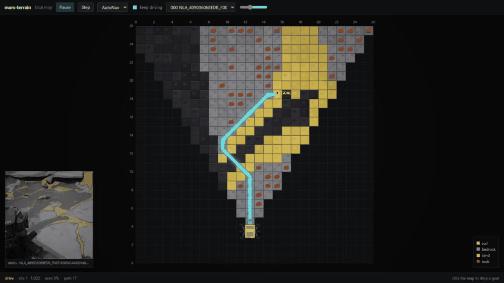
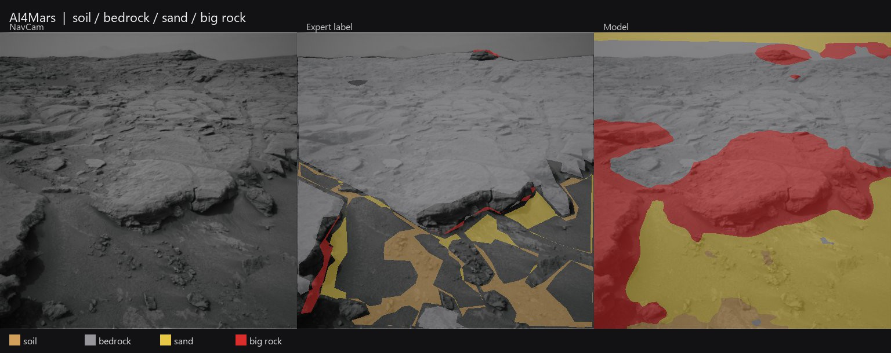
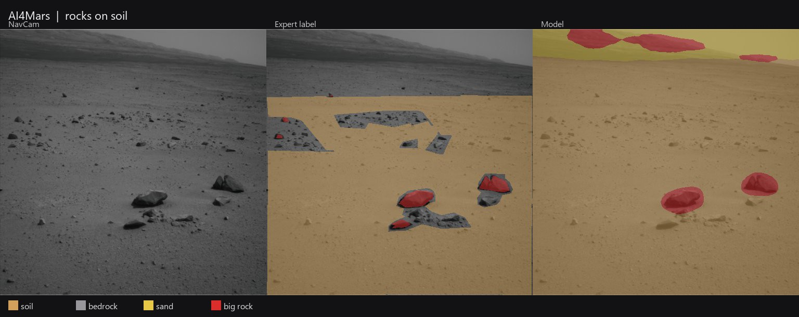

# Mars-Terrain

**Real Mars imagery -> learned terrain perception -> partial map -> autonomous navigation -> replanning**

**[▶ Live Demo](https://m-ahmad-amin.github.io/mars-terrain/)**

Mars-Terrain is an end-to-end simulated autonomous navigation loop for a Mars rover. A DeepLabv3-ResNet50 model trained on real Curiosity NavCam imagery ([AI4Mars](https://github.com/nasa-jpl/AI4MARS)) does terrain segmentation. We project that into a local cost map. The rover only sees what’s in its camera FOV, grows a belief map as it moves, and runs A* to a goal you click. If newly seen terrain blocks the route, it replans.
 


NavCam inset + belief map. Cyan = AutoNav path. Dark cells are still unseen.

```text
python -m web.app                               # browser UI at http://127.0.0.1:8000
python -m http.server 8088 --directory docs     # demo UI at http://127.0.0.1:8088
python -m src.demo --labels                     # old desktop window
```

In the site: Play, click the map for a goal, switch AutoNav / Blind / Guarded. Continuous mode loads the next NavCam when this patch is finished.

## How we built it

We started with the AI4Mars terrain-segmentation task: predicting terrain classes from Curiosity NavCam imagery and evaluating against NASA expert annotations. The label image is warped onto a flat ground grid (0.2 m cells, ~20 m ahead). Classes become costs. A small sim keeps two maps: ground truth, and the rover’s belief. A* only reads the belief. Each step reveals a cone and the path is recomputed.

The live demo is `python -m web.app` (FastAPI + a small dashboard). Continuous mode chains the next NavCam when the rover finishes a patch.

## Stack

| | |
|---|---|
| Language | Python 3 |
| Perception | PyTorch, torchvision DeepLabv3-ResNet50 |
| Data | AI4Mars MSL NavCam (JPEG + PNG masks) |
| Map / plan | NumPy, heapq A*, Pillow |
| UI | tkinter |
| Train | Colab T4, `notebooks/train_segmentation.ipynb` |

```text
src/train.py      fit the segmenter
src/infer.py      weights → label image
src/mapping.py    image → BEV + cost
src/planner.py    A*
src/sim.py        FOV, belief, step
src/demo.py       window
```

Weights: `outputs/checkpoints/best.pt` (gitignored). Data: `data/ai4mars-dataset-merged-0.6/msl/ncam`.

## Perception

Expert min1 holdout (322 frames). Crowd labels for training.

| soil | bedrock | sand | big rock | mIoU | acc |
|---:|---:|---:|---:|---:|---:|
| 0.91 | 0.81 | 0.86 | 0.11 | 0.67 | 0.92 |

Big rock is rare in the labels. We treat it - and unseen cells - as high cost (soil 1, bedrock 2.2, sand 5.5, rock 90, unknown 16).

NavCam | expert | model:





Tan soil, gray bedrock, yellow sand, red big rock.

## What’s next

- Better camera-to-ground projection than the flat warp.
- 2.5D view of the same grid if we want a clip that looks less like a debug tool.

Not next: a 3D Mars game. The model was trained on real NavCams; it would not transfer.
